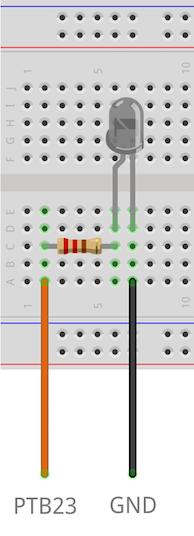
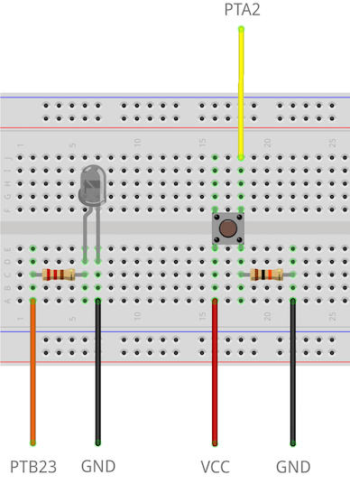

# Blinky on a breadboard

We've seen how to automatically blink the built-in LED, but the great thing about dev kits is that they allow us to add new sensors and peripherals and experiment with user interactions. Let's use an external LED instead of the on-board one, then add manual control.

If you skipped Blinky, please go [get the code for it](FirstProjectmbedOS.md). You'll need to modify that code to get this example working.

## The hardware

Get a breadboard, a 220 ohm resistor (or something close to 220 ohm), and two wires. 

To know how we should connect everything together we need to take a look at the pinout of the board. Normally, this is listed on the board's page on the mbed website (for example, here is the [FRDM-K64F pinout](https://www.mbed.com/en/development/hardware/boards/nxp/frdm_k64f/)). You can also do an image search for '[board-name] pinout'.

<span style="background-color: #F0F0F5; display:block; text-align:center; height:100%; padding:10px;"></span>

*Finding pinouts with your favourite search engine*

We need a digital pin for the LED. Since I'm using the FRDM-K64F, I selected pin PTB23/D4.

<span style="background-color: #F0F0F5; display:block; text-align:center; height:100%; padding:10px;"></span>

Now we're ready to set up the circuit.

<span style="background-color: #F0F0F5; display:block; text-align:center; height:100%; padding:10px;"></span>

*Black wire running from GND to the short leg of the LED. Orange wire running from PTB23 through a resistor to the long leg of the LED.*

## Changing the pin association in the code

Now we need to configure the LED in our [Blinky code](https://github.com/ARMmbed/example-mbedos-blinky/blob/master/source/blinky.cpp) to no longer reference `LED1`. To reference our pin we can use the name of the pin directly (`PTB23`) or we can use the standard name 'D4', which is mapped automatically to the right pin through [yotta](http://yottadocs.mbed.com/reference/config.html). The latter is prefered, as it makes it easier to port your code to other hardware.

Change [the ``blinky`` function](https://github.com/ARMmbed/example-mbedos-blinky/blob/master/source/blinky.cpp) to:

```cpp
static void blinky(void) {
    // If we use the standard name (D4), we need to prefix the pin name.
    // If we use PTB23, we do not need to do this.
    static DigitalOut led(YOTTA_CFG_HARDWARE_PINS_D4);
    led = !led;
    printf("LED = %d \r\n",led.read());
}
```

Now the LED on the breadboard blinks, rather than the LED on the board.

<span style="background-color: #F0F0F5; display:block; text-align:center; height:100%; padding:10px;"></span>

## Adding a button

Since we have the breadboard ready anyway, we can also change this program to toggle the LED when a button is being pressed, rather than every 500ms.

First we need to take another digital pin (in my case PTA2/D5), and wire the button up on the breadboard. Make sure to also have a pull-down resistor to ground. 

<span style="background-color: #F0F0F5; display:block; text-align:center; height:100%; padding:10px;"></span>

Now we can configure PTA2/D5 as an [`InterruptIn`](https://developer.mbed.org/handbook/InterruptIn) pin and get notified when the button gets pressed or released. Change 'source/app.cpp' to read:

```cpp
#include "mbed-drivers/mbed.h"

static DigitalOut led(YOTTA_CFG_HARDWARE_PINS_D4);

static void led_on(void) {
    led = true;    
    printf("LED = %d \r\n", led.read());
}

static void led_off(void) {
    led = false;
    printf("LED = %d \r\n", led.read());
}

void app_start(int, char**) {
    static InterruptIn button(YOTTA_CFG_HARDWARE_PINS_D5);
    
    // when we press the button the circuit closes, and turns the LED on
    button.rise(&led_on);
    // when we release the button the circuit opens again, turning the LED off
    button.fall(&led_off);
}
```

<span style="background-color: #F0F0F5; display:block; text-align:center; height:100%; padding:10px;"></span>
