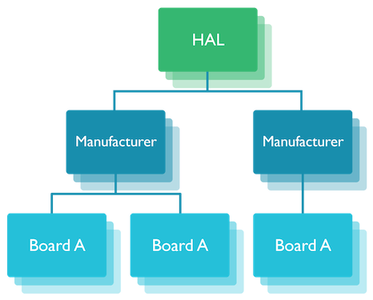
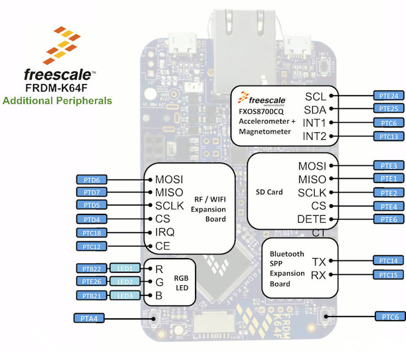

## Interfacing to hardware

mbed OS offers the APIs that interface directly with the hardware. While each API's hardware-facing side can delve into board-specific details, the side facing you - and your application - remains constant. That allows you to write a single piece of code and run it on all supported boards.

Hardware interfaces are handled by the mbed Hardware Abstraction Layer (HAL). The mbed HAL is an [interface](https://github.com/ARMmbed/mbed-hal/tree/master/mbed-hal) that has various generic manufacturer implementations, such as [Nordic](https://github.com/ARMmbed/mbed-hal-nordic) and [Freescale](https://github.com/ARMmbed/mbed-hal-freescale), as well as various board implementations.

<span style="display:block; text-align:center; padding:5px; border:1px solid #000;">
</span>

When you delve into board-specific implementations you get the mapping that HAL requires. The following example focuses on the FRDM-K64F implementation, which is the same board we use in this document's code examples.

### yotta and HAL selection

When you tell yotta which board you're building for (your target), yotta knows which modules that board requires. So when you say ``yotta target frdm-k64g-gcc`` and then ``yotta build``, the build is performed with your board's specific HAL.

<span style="background-color:#E6E6E6;  border:1px solid #000;display:block; height:100%; padding:10px">**Tip:** to learn about yotta targets, read [the chapter about mbed OS applications with yotta](app_on_yotta.md).</span>

We can see this when we run ``yotta ls`` in the Blinky directory we built earlier ([please refer to the quick guide if you haven't built Blinky yet](../FirstProjectmbedOS.md)):

```
user$ cd blinky
user$ yotta ls

my_blinky 0.0.1
┗─ mbed-drivers 0.8.3
  ┣─ mbed-hal 0.6.4 yotta_modules/mbed-hal
  ┃ ┗─ mbed-hal-freescale 0.5.2 yotta_modules/mbed-hal-freescale
  ┃   ┗─ mbed-hal-ksdk-mcu 0.5.4 yotta_modules/mbed-hal-ksdk-mcu
  ┃     ┣─ uvisor-lib 0.7.25 yotta_modules/uvisor-lib
  ┃     ┗─ mbed-hal-k64f 0.3.5 yotta_modules/mbed-hal-k64f
  ┃       ┗─ mbed-hal-frdm-k64f 0.4.4 yotta_modules/mbed-hal-frdm-k64f
  ┣─ cmsis-core 0.2.7 yotta_modules/cmsis-core
  ┃ ┗─ cmsis-core-freescale 0.1.4 yotta_modules/cmsis-core-freescale
  ┃   ┗─ cmsis-core-k64f 0.1.5 yotta_modules/cmsis-core-k64f
  ┣─ ualloc 0.1.0 yotta_modules/ualloc
  ┃ ┗─ dlmalloc 0.0.6 yotta_modules/dlmalloc
  ┣─ minar 0.7.1 yotta_modules/minar
  ┃ ┗─ minar-platform 0.3.4 yotta_modules/minar-platform
  ┃   ┗─ minar-platform-mbed 0.1.5 yotta_modules/minar-platform-mbed
  ┣─ core-util 0.1.2 yotta_modules/core-util
  ┗─ compiler-polyfill 1.0.4 yotta_modules/compiler-polyfill
```
Focusing on HAL, we can see that the board-specific implementation is actually multilayered: some is implemented for the manufacturer, in our case Freescale; some for the MCU, the K64F; and finally the specific combination for K64F and a Freescale board - the FRDM-K64F.

We'll see an implementation example in the next section, after we introduce our first hardware interface: GPIO.

### GPIO

General-purpose input/output (GPIO) is handled twice: in ``mbed-drivers``, to interface with your code; and in HAL, to interface with the board. There is a general GPIO header, but mbed-drivers and HAL include headers for different input and output types, and HAL further includes pin names, peripheral names and so on.

You can use the GPIO related APIs for digital input and output. You can also get a notification (an interrupt) when the logic value on a GPIO pin changes from 0 to 1 or from 1 to 0.

#### HAL implementation example - from the APIs to the hardware

This example focuses on the LEDs on our boards, but it introduces general principles and file structures that apply to all GPIO functionalities.

##### Mapping the user-facing API to pinouts

To support board-agnostic programming, the mapping of a functionality to a pin is handled by board-specific HAL implementations. Let's look at how our sample application, Blinky, uses a LED on the board:

```
static DigitalOut led(LED1);
```

The key here is the use of ``DigitalOut`` and ``LED1``. 

``DigitalOut.h`` is a header in ``mbed-drivers``. The class ``DigitalOut`` in that header creates a digital output connected to a pin specified in the code. 

Of course, we don't want you to have to specify the exact pin every time you write an application, as that will change on every board. So you only specify a generic LED1. ``DigitalOut`` then follows the ``mbed-drivers`` code (and its includes) to discover which pin LED1 is on the current board. 

``DigitalOut.h`` #includes ``platform.h``, which #includes ``PinNames.h``, which is in turn the header that maps the board's pins to our generic names. It is part of HAL, and is therefore board-specific. In our example, Blinky, we can find it in the ``yotta_module`` directory under the target name: ``/blinky/yotta_modules/mbed-hal-frdm-k64f/mbed-hal-frdm-k64f/``.

<span style="display:block; text-align:center; padding:5px; border:1px solid #000;">
</span>

Let's look at how the LEDs are mapped in ``PinNames.h`` for the FRDM-K64F:

```
LED_RED   = PTB22,
LED_GREEN = PTE26,
LED_BLUE  = PTB21,

// mbed original LED naming
LED1 = LED_RED,
LED2 = LED_GREEN,
LED3 = LED_BLUE,
LED4 = LED_RED,
```

LED1 is mapped to LED_RED above it. LED_RED is mapped to PTB22. If we look further up the code, we can see the PTB and PTE definitions of all three LED colours:

```
PTB22 = (1 << GPIO_PORT_SHIFT | 22),
PTE26 = (4 << GPIO_PORT_SHIFT | 26),
PTB21 = (1 << GPIO_PORT_SHIFT | 21),
```

The numbers PTB22, PTE26 and PTB21 are taken directly from the board's pinout:

<span style="display:block; text-align:center; padding:5px; border:1px solid #000;">
</span>

This brings us all the way from a generic LED1 call in your code to a board-specific pin use.

## Further reading

You might be interested in the Doxygen for [mbed-drivers](https://docs.mbed.com/docs/mbed-drivers-api/en/latest/api/index.html).
