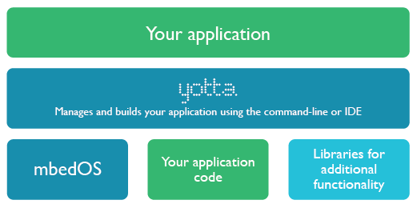

# mbed OS overview

mbed OS is the operating system we created for mbed-enabled boards. It allows your C++ applications to run on these boards by providing APIs that you can use from your application to control the hardware.

## Features

We designed mbed OS specifically for constrained devices, so it works behind the scenes to automatically make the most of the limited hardware and network resources available:

* It's modular: it has a code base that is common to all applications running on all hardware, and additional modules that extend functionality and create hardware-specific interfaces. The modules are only compiled if your application needs them; you don't need to waste memory on unused code.

* It's single-threaded and event-driven, so you can use it even on small devices.

* It abstracts the hardware, so that an application always "sees" the same interface, no matter which board it's running on. mbed OS then matches the interface to the actual hardware without you manually changing the code. This allows you to write the application once, then deploy it on any supported board. mbed OS also works seamlessly with peripherals and extension boards.

* It efficiently manages power and schedules tasks, so that even demanding applications can operate on low-power devices.

* It manages both device and communication security using mbed OS uVisor and mbed TLS, respectively.

* It supports multiple networking options: Bluetooth Low Energy, Ethernet, WiFi (coming soon), Thread and 6LoWPAN.

* It works with device management protocols - LWM2M and CoAP - so that you can perform large-scale remote updates.

mbed OS also works with other ARM mbed tools, like our testing tool (Greentea) and mbed Device Server. To learn more about these tools, see the [main site](https://www.mbed.com/en/).

## mbed OS code base

As explained above, mbed OS is modular. This section gives a short review of the main modules. Some of these will be reviewed in greater detail later.

### Core OS modules
[__compiler-polyfill__](https://github.com/ARMmbed/compiler-polyfill)

Common compiler intrinsics and attributes made portable across toolchains.

[__core-util__](https://github.com/ARMmbed/core-util)

Core data structures and primitives for the OS.

[__minar__](github.com/ARMmbed/minar)

The mbed OS event scheduler.

[__ualloc__](https://github.com/ARMmbed/ualloc) and [__dlmalloc__](https://github.com/ARMmbed/dlmalloc)

Memory allocation for mbed OS.

[__uvisor__](https://github.com/ARMmbed/uvisor)

mbed OS uVisor is a supervisory kernel for security on mbed OS.

### Hardware abstraction and drivers
[__mbed-drivers__](https://github.com/ARMmbed/mbed-drivers)

Abstract drivers for common hardware peripherals and communications interfaces such as SPI and I2C. Provides a higher level interface than the mbed HAL; these are the APIs that applications should use.

[__cmsis-core__](https://github.com/ARMmbed/cmsis-core)

ARM's official low level hardware abstraction for Cortex-M.

[__mbed-hal__](https://github.com/ARMmbed/mbed-hal)

The mbed Hardware Abstraction Layer (HAL). This is explored in greater detail [below]().

### Networking and connectivity
[__ble__](https://github.com/ARMmbed/ble)

APIs for using Bluetooth Low Energy.

[__mbed-mesh-api__](https://github.com/ARMmbed/mbed-mesh-api)

APIs for initialising and using the mesh network.

[__mbedtls__](https://github.com/ARMmbed/mbedtls)

mbed TLS, the SSL/TLS stack (including cryptographic and certificates handling functionality).

[__sal__](https://github.com/ARMmbed/sal)

The mbed OS socket abstraction layer (SAL). Provides a common interface for networking stacks from ARM and partners.

[__sal-stack-nanostack__](https://github.com/ARMmbed/sal-stack-nanostack)

Our IPv6/6LoWPAN stack.

[__sockets__](https://github.com/ARMmbed/sockets)

High level portable socket layer (sitting on top of the SAL).

### mbed Client
[__mbed-client-c__](https://github.com/ARMmbed/mbed-client-c)

Core library in C.

[__mbed-client__](https://github.com/ARMmbed/mbed-client)

C++ API (use this one rather than the C one, as it's much easier to use correctly).

[__mbed-client-mbed-os__](https://github.com/ARMmbed/mbed-client-mbed-os)

mbed OS-specific implementation for mbed Client.

[__mbed-client-mbedtls__](https://github.com/ARMmbed/mbed-client-mbed-tls)

mbed TLS-specific implementation for mbed Client.

## mbed OS and yotta

yotta is the build system we use for mbed OS. We'll get into the details of it [later](app_on_yotta.md), but what you need to understand at this point is that mbed OS applications cannot be built without yotta. 

yotta combines our code (application) with the mbed OS code-base and any other module (reusable library) that we may need. To tell yotta what our application needs, we add a list of dependencies to each application we write. The easiest way to add mbed OS to our application when we build it is to describe the component ``mbed-drivers`` as a dependency of our application, because ``mbed-drivers`` has most other components as its own dependencies, so yotta will build what we need.

**Tip:** Some components must be manually included; we'll tell you about that when we review them in this guide.

What this all means is that to build applications that can run on top of mbed OS, you need:

* yotta.
* mbed OS modules and optional additional libraries, which yotta gets for you.
* Your own application code.

**Note:** IDE support is not available yet. If you're interested in a particular IDE, talk to us on [the forum](forums.mbed.com).
